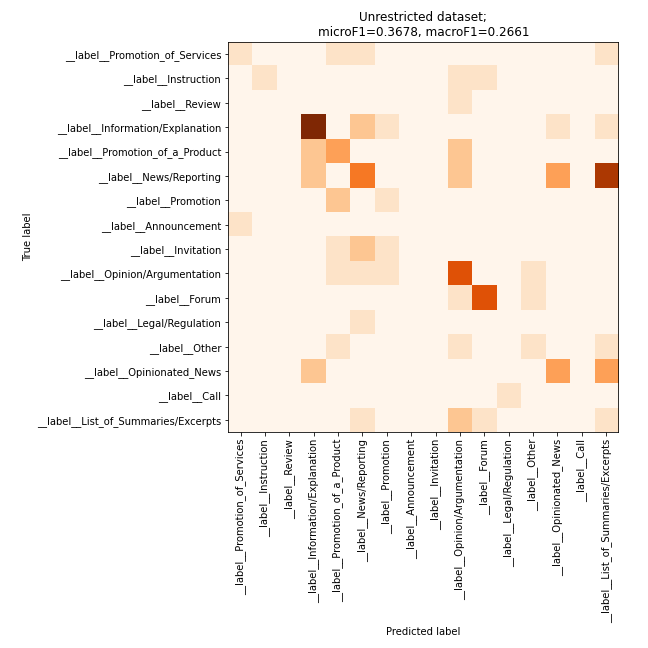
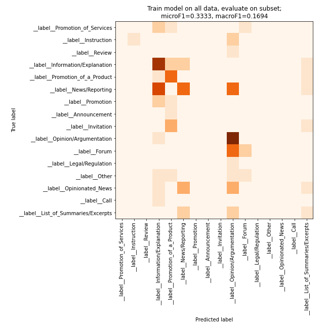
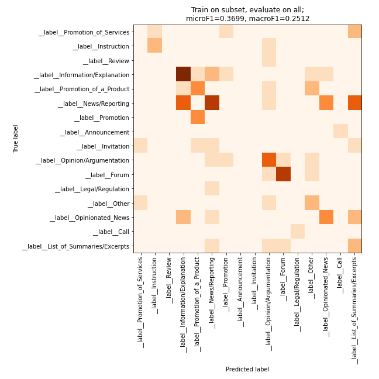

# First experiment

## Result summary

### micro F1 metrics

|trained on \ evaluated on |full dataset| restricted dataset|
|---|---|---|
|full dataset |0.4162 |0.4277 | 
|restricted dataset |0.3699 |0.3626 |

### macro F1 metrics

|trained on \ evaluated on |full dataset| restricted dataset|
|---|---|---|
|full dataset |0.2949 | 0.2966|
|restricted dataset |0.2512 |0.2664 |

## Methodology 

Once the data has been prepared, I started by training the first models. As of now I am comparing the performances in two scenarios: 

* with all the data kept and 
* with only the paragraphs labeled with keep==True

In this scenario we do not care about label distributions. For now only the primary label has been taken into account, which simplifies evaluation steps. `fasttext` formatted files have been prepared as described in the LaTeX draft, meaning that in this case where we do not care for secondary labels, the same text is entered into the file three times with the same label.

The data was trained with fasttext method `train_supervised` with the dev section provided as the `autotuneValidationFile` and training was capped at 600 seconds.

Two models were trained, one for data with `keep==True` and one for data with complete disregard for keep parameter.
Micro and macro F1 scores are plotted in the confusion matrix plot title to assure traceability, advise if change of format is required.

With all the data I plotted this confusion matrix:

While the restricted dataset looks like this:

For now it seems that in this symmetric experiment the unrestricted dataset performs better than the restricted dataset. I shall now try and cross these models over, to see if the performance improves.

If the model is trained on full dataset and then evaluated on restricted dataset, the confusion matrix and metrics look like this:

And *mutatis mutandis*:

## Remarks before proceeding

It would seem that training on unrestricted dataset is better for the models' performances. I therefore propose the future models be trained with full dataset, regardless of the `keep` tag.

