# First experiment

## Result summary

### micro F1 metrics

|trained on \ evaluated on |full dataset| restricted dataset|
|---|---|---|
|full dataset |0.4162 |0.4277 | 
|restricted dataset |0.3699 |0.3626 |

### macro F1 metrics

|trained on \ evaluated on |full dataset| restricted dataset|
|---|---|---|
|full dataset |0.2949 | 0.2966|
|restricted dataset |0.2512 |0.2664 |

## Methodology 

Once the data has been prepared, I started by training the first models. As of now I am comparing the performances in two scenarios: 

* with all the data kept and 
* with only the paragraphs labeled with keep==True

In this scenario we do not care about label distributions. For now only the primary label has been taken into account, which simplifies evaluation steps. `fasttext` formatted files have been prepared as described in the LaTeX draft, meaning that in this case where we do not care for secondary labels, the same text is entered into the file three times with the same label.

The data was trained with fasttext method `train_supervised` with the dev section provided as the `autotuneValidationFile` and training was capped at 600 seconds.

Two models were trained, one for data with `keep==True` and one for data with complete disregard for keep parameter.
Micro and macro F1 scores are plotted in the confusion matrix plot title to assure traceability, advise if change of format is required.

With all the data I plotted this confusion matrix:


While the restricted dataset looks like this:

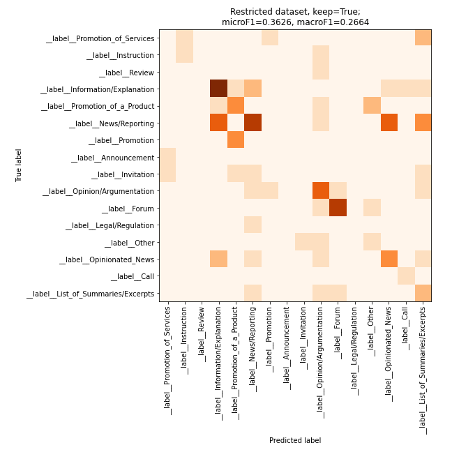


For now it seems that in this symmetric experiment the unrestricted dataset performs better than the restricted dataset. I shall now try and cross these models over, to see if the performance improves.

If the model is trained on full dataset and then evaluated on restricted dataset, the confusion matrix and metrics look like this:


And *mutatis mutandis*:


I repeated the training and evaluation a few times. 


First run:

### micro F1 metrics

|trained on \ evaluated on |full dataset| restricted dataset|
|---|---|---|
|full dataset |0.4162 |0.4277 | 
|restricted dataset |0.3699 |0.3626 |


### macro F1 metrics

|trained on \ evaluated on |full dataset| restricted dataset|
|---|---|---|
|full dataset |0.2949 | 0.2966|
|restricted dataset |0.2512 |0.2664 |

Second run:

### micro F1 metrics

|trained on \ evaluated on |full dataset| restricted dataset|
|---|---|---|
|full dataset |0.3563 |0.3333 | 
|restricted dataset |0.3699 |0.3626 |

### macro F1 metrics

|trained on \ evaluated on |full dataset| restricted dataset|
|---|---|---|
|full dataset |0.1549 | 0.1694|
|restricted dataset |0.2512 |0.2664 |

Third run:

### micro F1 metrics

|trained on \ evaluated on |full dataset| restricted dataset|
|---|---|---|
|full dataset |0.3678 |0.3333 | 
|restricted dataset |0.3699 |0. 3626|

### macro F1 metrics

|trained on \ evaluated on |full dataset| restricted dataset|
|---|---|---|
|full dataset |0.2661 | 0.1691|
|restricted dataset |0.2512 |0. 2664|

## Remarks before proceeding

It would seem that training on unrestricted dataset is better for the models' performances. I therefore propose the future models be trained with full dataset, regardless of the `keep` tag.

# Second Experiment

## On the evaluation of multilabel predictions

The output of the fasttext models is already a distribution, althogh we usually only look at the most probable label. The _true_ distribution can be parsed from the data and it is always either a distribution where a single label reaches 1 or a combination of two labels, one with probability 0.66 and another with probability 0.33.

These two combinations can be evaluated with Jensen-Shannon distance measure, but in this case we lose information on the distributions of the labels. For a series of test data inputs it would return a series of scalar values, with no clear indication of what to do next. We could average it, or maybe plot the average for every primary label to get a sense of which classes perform better, but that is about it.

What we could do instead is make use of F1 metric, that we already have and which can be directly compared with previous measurements.

It seems all prediction probabilities from `fasttext` always sum up to 1.0002, so not exactly to unity.

# After-meeting addendum

I corrected the data so that I could perform the experiments with data based on the `duplicate` tag instead of the `keep` tag. While performing repeated training with the proper dataset I implemented a dummy classifier to check how the metrics look like for that. I checked two strategies, both on full dataset and on deduplicated dataset.

  ## Full dataset:
  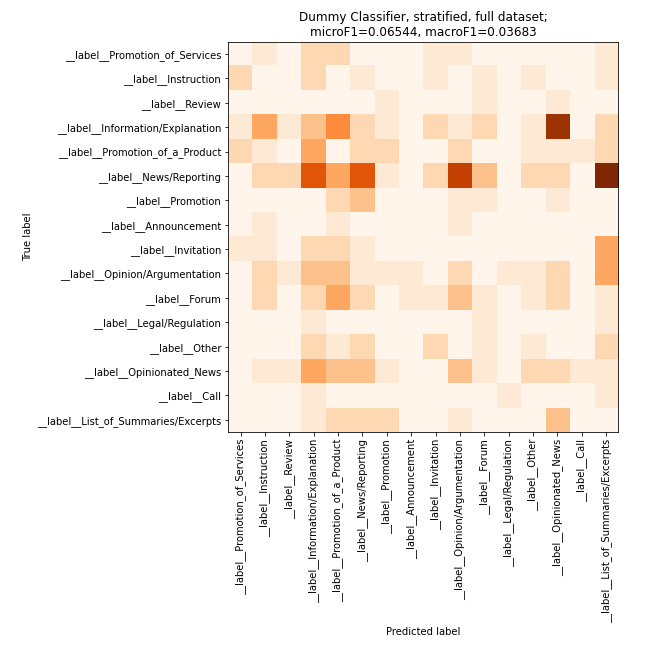

  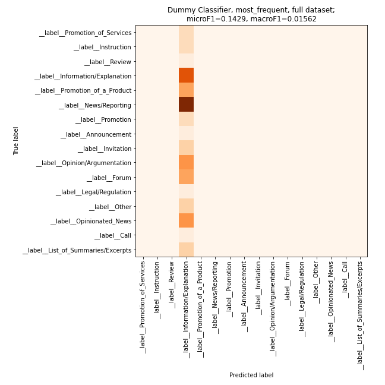

  ## Deduplicated dataset:

  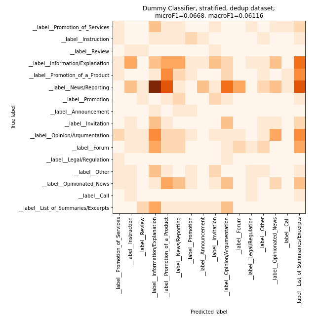

  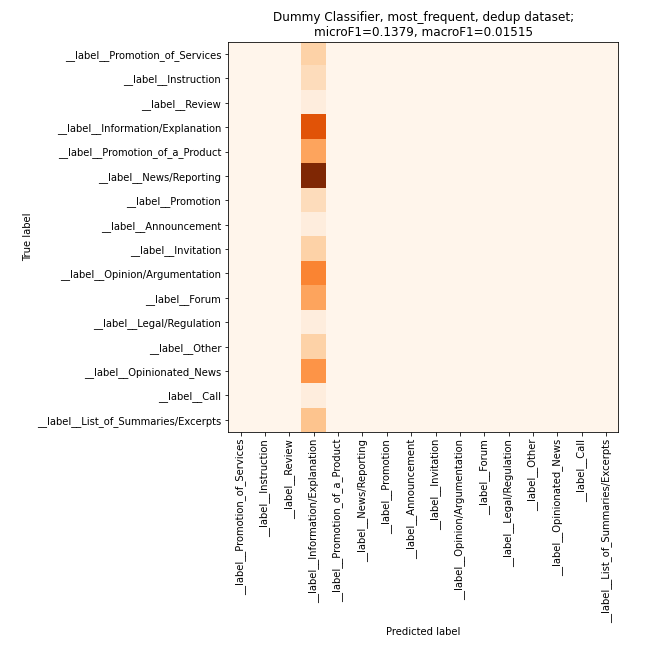

I noticed that the models that were all optimized the same amount of time produced files whose size varied quite a lot:

```bash
(base) peterr@kt-gpu-vm-1TB:~/macocu/task5_webgenres/data/models/experiment1$ ls -lh
total 34G
-rw-rw-r-- 1 peterr peterr  38M Oct 25 11:03 model_all_onlyprimary.bin
-rw-rw-r-- 1 peterr peterr 5.8G Oct 25 16:13 model_full_primary_15min_run00.bin
-rw-rw-r-- 1 peterr peterr 1.3G Oct 25 16:35 model_full_primary_15min_run01.bin
-rw-rw-r-- 1 peterr peterr 2.7G Oct 25 16:50 model_full_primary_15min_run02.bin
-rw-rw-r-- 1 peterr peterr 1.9G Oct 25 17:05 model_full_primary_15min_run03.bin
-rw-rw-r-- 1 peterr peterr 332M Oct 25 17:23 model_full_primary_15min_run04.bin
-rw-rw-r-- 1 peterr peterr 1.3G Oct 25 17:44 model_full_primary_15min_run05.bin
-rw-rw-r-- 1 peterr peterr 4.8G Oct 25 18:01 model_full_primary_15min_run06.bin
-rw-rw-r-- 1 peterr peterr 1.9G Oct 25 18:16 model_full_primary_15min_run07.bin
-rw-rw-r-- 1 peterr peterr 1.3G Oct 25 18:38 model_full_primary_15min_run08.bin
-rw-rw-r-- 1 peterr peterr 1.3G Oct 25 19:00 model_full_primary_15min_run09.bin
-rw-rw-r-- 1 peterr peterr 1.4G Oct 25 19:15 model_full_primary_15min_run10.bin
-rw-rw-r-- 1 peterr peterr 717M Oct 25 19:31 model_full_primary_15min_run11.bin
-rw-rw-r-- 1 peterr peterr 1.3G Oct 25 19:52 model_full_primary_15min_run12.bin
-rw-rw-r-- 1 peterr peterr 1.5G Oct 25 20:09 model_full_primary_15min_run13.bin
-rw-rw-r-- 1 peterr peterr 4.8G Oct 25 20:26 model_full_primary_15min_run14.bin
-rw-rw-r-- 1 peterr peterr 1.3G Oct 25 20:47 model_full_primary_15min_run15.bin
-rw-rw-r-- 1 peterr peterr 169M Oct 25 21:02 model_full_primary_15min_run16.bin
-rw-rw-r-- 1 peterr peterr    0 Oct 25 21:17 model_full_primary_15min_run17.bin
-rw-rw-r-- 1 peterr peterr    0 Oct 25 21:39 model_full_primary_15min_run18.bin
-rw-rw-r-- 1 peterr peterr    0 Oct 25 21:54 model_full_primary_15min_run19.bin
-rw-rw-r-- 1 peterr peterr  11M Oct 25 11:03 model_onlykeep_onlyprimary.bin
```

I repeatedly trained the classifiers on both datasets for 15 minutes. The resulting macro F1 scores look like this:

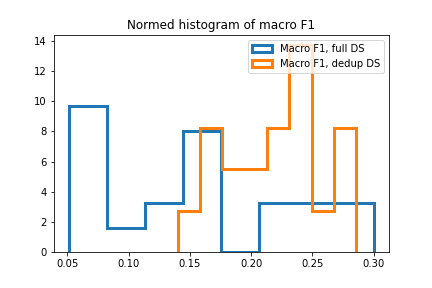

while the micro F1 scores look like this

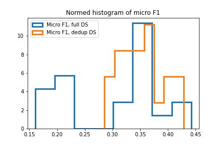

Remarks:
+ On the full dataset the average metrics are lower than on the deduplicated dataset
+ Variances of both metrics recorded were significantly smaller for models trained on deduplicated dataset.
+ For both metrics the best performing runs were trained on the **full** dataset

We can produce an average performing model also by training the model without optimization for 200 epochs. In this case the training takes only a few seconds and the calculated metrics are about an order of magnitude less dispersed than with optimization.

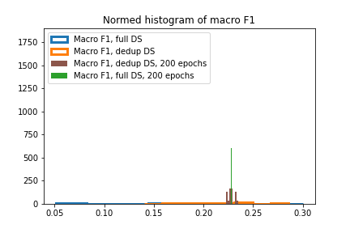

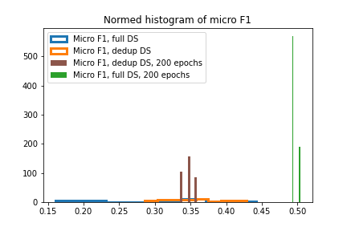


# Addendum Fri Oct 29 09:36:35 CEST 2021

So far W&B hyperparameter optimization was not successful. The traceback is a bit mistic:


```
RuntimeError: CUDA error: device-side assert triggered
CUDA kernel errors might be asynchronously reported at some other API call,so the stacktrace below might be incorrect.
For debugging consider passing CUDA_LAUNCH_BLOCKING=1.
```
The error occurs after the first optimization run, but when reruning the same code, it gets raised immediately.

The GPU memory is fine:

```(base) peterr@kt-gpu-vm-1TB:~$ nvidia-smi
Fri Oct 29 09:47:34 2021       
+-----------------------------------------------------------------------------+
| NVIDIA-SMI 460.32.03    Driver Version: 460.32.03    CUDA Version: 11.2     |
|-------------------------------+----------------------+----------------------+
| GPU  Name        Persistence-M| Bus-Id        Disp.A | Volatile Uncorr. ECC |
| Fan  Temp  Perf  Pwr:Usage/Cap|         Memory-Usage | GPU-Util  Compute M. |
|                               |                      |               MIG M. |
|===============================+======================+======================|
|   0  Tesla V100-SXM2...  On   | 00000000:03:00.0 Off |                    0 |
| N/A   30C    P0    54W / 300W |   2547MiB / 32510MiB |      0%      Default |
|                               |                      |                  N/A |
+-------------------------------+----------------------+----------------------+
                                                                               
+-----------------------------------------------------------------------------+
| Processes:                                                                  |
|  GPU   GI   CI        PID   Type   Process name                  GPU Memory |
|        ID   ID                                                   Usage      |
|=============================================================================|
|    0   N/A  N/A       971      C   ...terr/anaconda3/bin/python     2545MiB |
+-----------------------------------------------------------------------------+
```

If I instead set the option `use_cuda = False`, I get an error raised by pytorch when calculating cross entropy:

```IndexError: Target 9 is out of bounds.```

With CUDA still disabled I removed the preprocessing from the code, which means that the labels were kept as a list of strings. Again I was not successfull, this time I got served with 

```ValueError: too many dimensions 'str'```

Dropping the batch size to 4 produced the same error. I finally reimplemented numerical encoder again to remove this error, which some sources say could be due to strings not being converted to numerical types automatically. And with this setup we again get the first CUDA runtime error...

I also tried this setup with CUDA disabled, raising the IndexError again.

Recasting the numeric labels as integers instead of floats did not change anything.

# Addendum Fri Oct 29 11:35:38 CEST 2021

As per Nikola's suggestion I'm omitting the hyperparameter optimization and moving on to training directly.

I can't escape the CUDA errors. My current attempt is explicitly setting the number of labels in the text. It did not work on GPU but it does work with CUDA disabled.

5 epochs takes 20 minutes, but the results are not encouraging (macro F1: 0.1273). I will repeat the training again with 10 epochs.


# Addendum 2021-11-02T08:25:06

The cache, wandb files and output models once again filled the diskspace beyond usability. Furthermore, I found the full disk corrupted the ipynb file I used to run and evaluate results, rendering the file unusable. I cleaned the auxiliary files and continued searching for a practical implementation of simpletransformers classifier from scratch.

As before I encountered unexpected errors with textual labels, which is why I manually converted them to integers in parsing. In this configuration the training was successfully started. I can also use CUDA, which makes the training about twice as fast.

After the initial hurdles I was able to produce this confusion matrix plot:

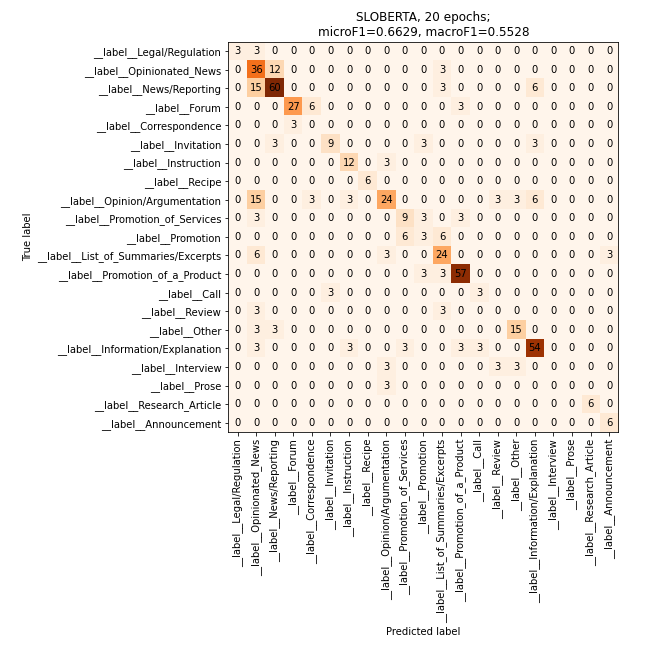

As we can see, the confusion matrix is way more diagonal, which is confirmed also by the biggest values of both metrics used. I shall now try and improve this milestone with prolonged training:


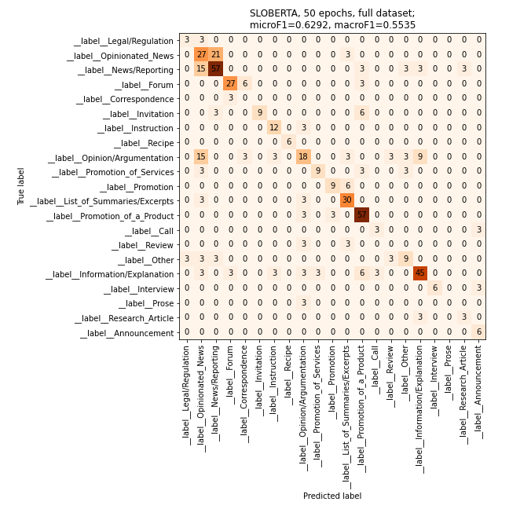

# Addendum 2021-11-02T17:31:45

I've started a hyperparameter optimization of sorts. On existing splits I'm training on train and evaluating on dev+test. The grid search will consist of running through two possible sequence lenghts (256 and 512), different epochs (5, 10, 20, 30, 50, 70), and full or deduplicated datasets.

More information to follow.

# Addendum 2021-11-03T06:34:52

Grid search for optimal parameters crashed sometime during the night, but the already calculated results were recoverable and we could continue with the training and evaluations right away.


In a scenario where we only look at the performance of the model under its previous configuration we can see that we cannot confirm our hypothesis that the model starts overfitting after 30 epochs:

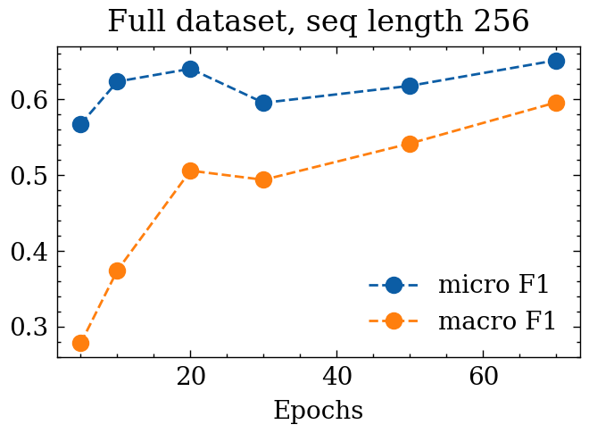

A similar behaviour can also be seen on dedupped dataset:

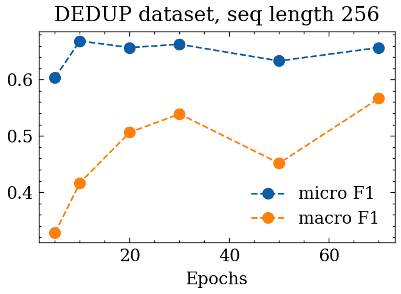

To directly compare the effect of the sequence length and dataset size, I plotted the macro and micro F1 separately:

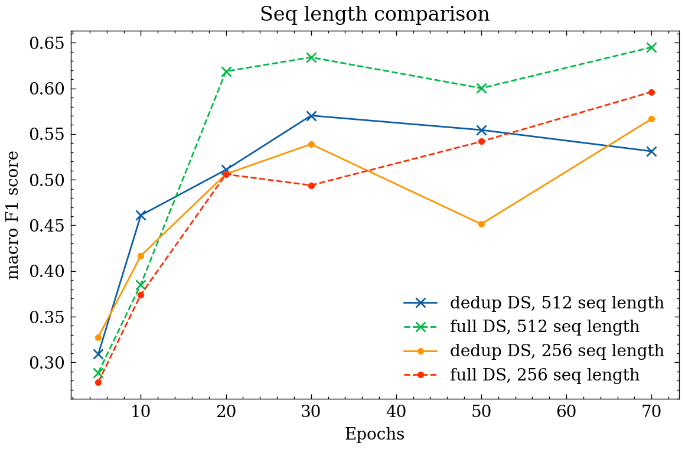

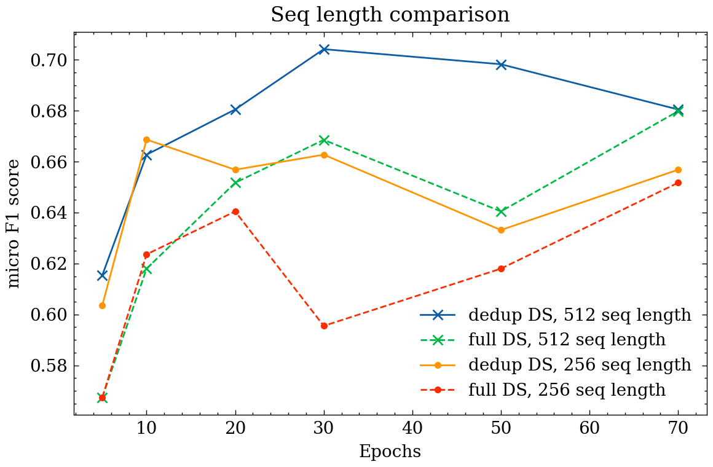


In this preliminary run it would seem that we should really increase the sequence length to 512 and work on full dataset to maximize macro F1 score. There seems to be still some room for improvement regarding the number of epochs. I will run more tests to confirm this, as well as to check what is going on with the model, trained for 30 epochs, that seems to be outlier.

# Addendum 2021-11-03T18:13:57

I inserted a few additional datapoints and calculated the metrics for those as well. Unfortunately, the sweep was not fully successful due to CUDA memory errors that I was not able to resolve. The configurations that workd are evaluated below:

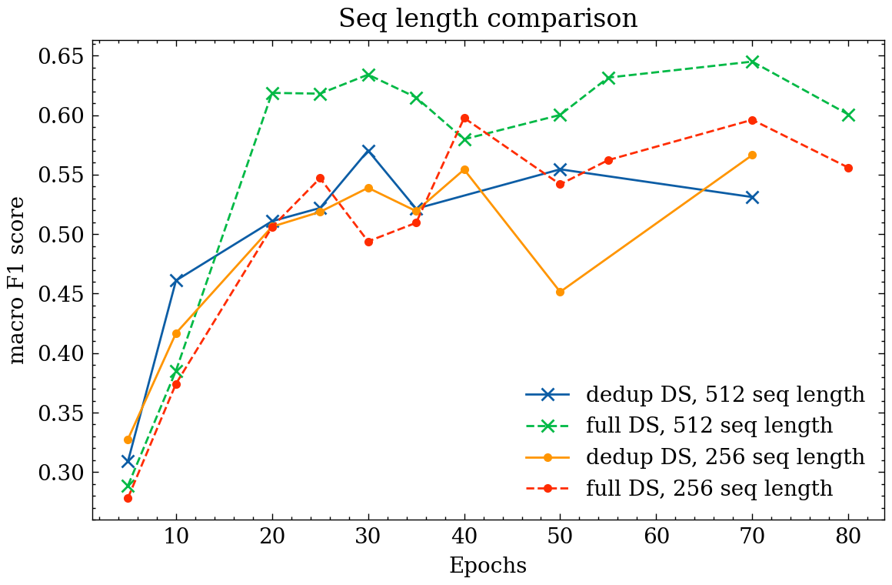

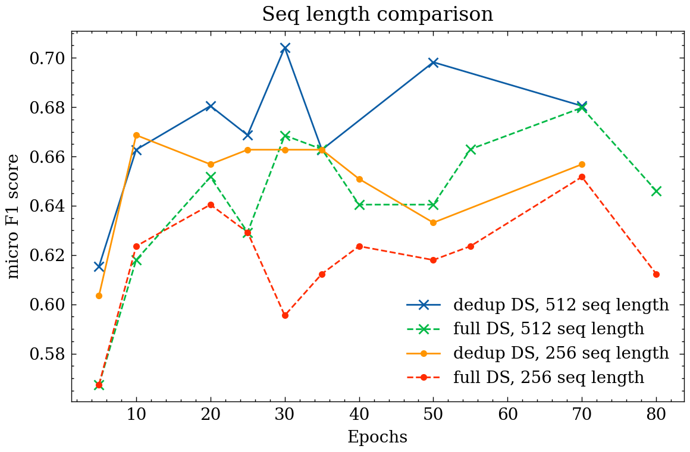


# Addendum 2021-11-04T08:23:28

New data splits are ready. Great care was taken to assure no domain leakage as well as consinstent primary label distribution. The algorythm used is partially stochastic and exact duplication of the process will not be easy. The distributions are as follow:

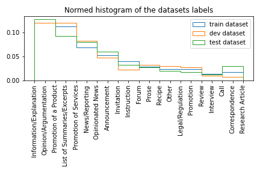

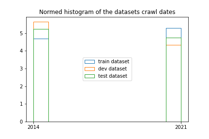

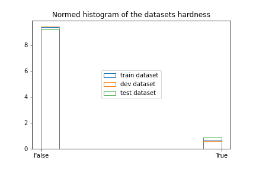

With these changes I can continue with the experiments.

# First experiment - compare using all text vs. using only non-duplicates (Q1)

In a similar fashion than _Beyond the English Web_ I train the classifier on train split (either dedupped or nor) and evaluate it on all dev and test splits. The sequence length used is 512 and the number of epochs is fixed at 30, the presumed optimum from preliminary experiments.

The results are logged, so even in the case of catastrophic error some data should be recoverable. By extrapolating the first runs I estimate the training will take an hour for every training dataset, so about 2h in total.


# Addendum 2021-11-04T13:03:12

First results are in. ~~Three aditional runs on deduplicated data are still running, they will be done soon.~~  When done, I will have a sample of at least 5 training runs, evaluated on either dev or test data, either full or deduplicated. In the table below the results are sorted by descending average macro F1 score:

|trained on | evaluated on | micro F1 | macro F1|
|---        | ---          | ---      | ---     |
|full|test, full|0.615 +/- 0.021|0.613+/-0.0251|
|full|test, dd|0.618 +/- 0.00873|0.56+/-0.013|
|dd|test, dd|0.623 +/- 0.0126|0.559+/-0.0428|
|full|dev, dd|0.635 +/- 0.00932|0.558+/-0.0162|
|dd|dev, dd|0.597 +/- 0.00919|0.552+/-0.0387|
|full|dev, full|0.583 +/- 0.00927|0.506+/-0.0249|
|dd|test, full|0.541 +/- 0.0129|0.5+/-0.0287|
|dd|dev, full|0.529 +/- 0.0179|0.451+/-0.0547|

It still seems that there are benefits in keeping all of the training data. As of yet I cannot yet decisively why test and dev splits behave rather differently. I will augment these average metrics with some confusion matrices, which were also logged during the evaluation process.


For ALL the runs, trained on full data and evaluated on full test split, the sum of all of the confusion matrices looks like this:

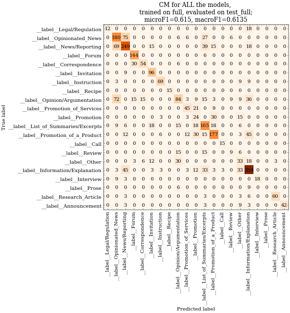

While for all the runs, trained on full data and evaluated on full _dev_ split, the sum of all of the confusion matrices looks like this:

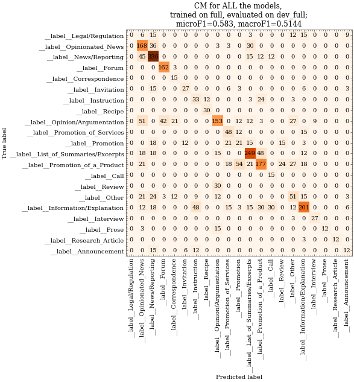

I also plotted individual confusion matrices and saved them in the `images` folder, but I shall not paste them here as they would clutter the log.

# Addendum 2021-11-04T16:11:43

In concordance with the decisions from the Skype meeting I prepare a new dataset, this time again looking at the `keep` tag and disregarding the `duplicate` tag. I set up the experiment in the same manner as before, trained the model 5 times (30 epochs, 512 seq length), and after every run I evaluated it on full test set and deduplicated test set. 

We will need to ascertain that the presumed best performing models are in fact the best. Consider this section of the upper table:

|trained on | evaluated on | micro F1 | macro F1|
|---        | ---          | ---      | ---     |
|full|test, full|0.615 +/- 0.021|0.613+/-0.0251|
|dd|test, dd|0.623 +/- 0.0126|0.559+/-0.0428|

We need to see whether the performance of the second model (trained and evaluated on dedup dataset) is in fact statistically significantly worse than that of the first model (trained and evaluated on full dataset).

|    | description                                             | micro F1         | macro F1         |
|---:|:--------------------------------------------------------|:-----------------|:-----------------|
|  0 | trained on full, evaluated on full                      | 0.615 +/- 0.0235 | 0.613 +/- 0.0281 |
|  1 | trained on deduplicated, evaluated on deduplicated      | 0.623 +/- 0.0137 | 0.559 +/- 0.0463 |
|  2 | **trained on only keep == True, evaluated on deduplicated **| 0.673 +/- 0.0189 | 0.65 +/- 0.0299  |
|  3 | trained on only keep == True, evaluated on full         | 0.56 +/- 0.0278  | 0.551 +/- 0.0412 |

As we can see, both micro and macro F1 scores are more than 1-sigma better than alternatives. I therefore start preparing the data with the secondary labels with this setup. For training data only the data with tag `keep:true` will be taken, and for evaluation only data with `duplicate:false` will be taken. 

# Addendum 2021-11-05T07:49:10

Let's check the statistical significance of the results above. In the meeting we said we want to prove that setup `train: full, test: full` is better than `train:dd, test:dd`.
 
 * Micro F1:
Since the average value of micro F1 is lower for the proposed best model, we can't expect low p-values, and so:
```
Wilcoxon p value: 0.844 		(alternative hypothesis: first is greater than the second)
MannWhithey p value: 0.853 		(alternative hypothesis: first is greater than the second)
Student p value: 0.383 		(null hypothesis: samples have identical average, equal variance is assumed but not necessary)
Higher average: 0.615, lower average: 0.6264
```

* Macro F1:

Again the hypothesis was that  `train: full, test: full` is better than `train:dd, test:dd`. In this case we see the differences are not statistically significant:

```
Wilcoxon p value: 0.0312 		(alternative hypothesis: first is greater than the second)
MannWhithey p value: 0.0718 		(alternative hypothesis: first is greater than the second)
Student p value: 0.107 		(null hypothesis: samples have identical average, equal variance is assumed but not necessary)
Higher average: 0.6129, lower average: 0.5643
```

As we can see, there is not much we can say for certain. One metric favours the first setup and another the second. The differences are not statistically significant.

We can also try and test that the apparently best configuration `train: only keep, test:dd` is better than the other two strategies discussed here:

* Micro F1:

Tested against `train:full, test:full`:
```
Wilcoxon p value: 0.0312 		(alternative hypothesis: first is greater than the second)
MannWhithey p value: 0.0106 		(alternative hypothesis: first is greater than the second)
Student p value: 0.0026 		(null hypothesis: samples have identical average, equal variance is assumed but not necessary)
Higher average: 0.673, lower average: 0.615
```

Tested against `train:dd, test:dd`:
```
Wilcoxon p value: 0.0312 		(alternative hypothesis: first is greater than the second)
MannWhithey p value: 0.00583 		(alternative hypothesis: first is greater than the second)
Student p value: 0.00241 		(null hypothesis: samples have identical average, equal variance is assumed but not necessary)
Higher average: 0.673, lower average: 0.6264
```

* Macro F1:

Tested against `train:full, test:full`: **-> not statistically significant**
```
Wilcoxon p value: 0.0938 		(alternative hypothesis: first is greater than the second)
MannWhithey p value: 0.0473 		(alternative hypothesis: first is greater than the second)
Student p value: 0.0791 		(null hypothesis: samples have identical average, equal variance is assumed but not necessary)
Higher average: 0.6498, lower average: 0.6129
```

Tested against `train:dd, test:dd`:
```
Wilcoxon p value: 0.0312 		(alternative hypothesis: first is greater than the second)
MannWhithey p value: 0.0108 		(alternative hypothesis: first is greater than the second)
Student p value: 0.0137 		(null hypothesis: samples have identical average, equal variance is assumed but not necessary)
Higher average: 0.6498, lower average: 0.5643
```

As we can see, we cannot reject the hypothesis that macro F1 is higher in the case of `train: only keep, test:dd` than in the case of `train:dd, test:dd`. The rest of the comparisons show p<0.05.


# Addendum 2021-11-07T17:49:10

New data was prepared, with the changes on secondary label as agreed (`DELETE secondary label WHERE primary label IS 'List of Summaries/Excerpts'`).

For the secondary experiment only training data instances where `keep=True`, and evaluation will be performed on deduplicated test data.

After evaluating we first parse the true and predicted labels. With the combined primary and secondary labels some preprocessing was needed to extract exactly what we need. Two strategies will be looked into:

1. "Pessimistic" case: we have data prepared in a three-instances manner both for train and test, we predict for each test triple one label and repeat it three times, if there is only one label in test, we will have either three hits or three misses, in the case of 2 and 1, we will have either 2 hits, 1 hit, or 0 hits


2. The classifier predicts a label and the label is then evaluated against first and secondary labels. If the prediction is equal to primary, all is clear, if it is equal to secondary, consider this a hit for the secondary category, if it fails on both, then it is a miss for the primary category
   

We get the following metrics:


|    | description                                             | micro F1         | macro F1         |
|---:|:--------------------------------------------------------|:-----------------|:-----------------|
|  1 | trained on keep=True, evaluated on dedup, with secondary labels, pessimistic metric| 0.61 +/- 0.0265 | 0.531 +/- 0.0424|
|  2 | trained on keep=True, evaluated on dedup, with secondary labels, optimistic metric| 0.664 +/- 0.025 | 0.556 +/- 0.0419|

As suspected, the pessimistic metrics are lower than optimistic, but the difference is not big.


# Addendum 2021-11-08T12:30:00

We will repeat the primary-label-only training on different setups of training data and evaluate it on dev, test, and devtest. First I setup a training process that iterated through configurations and trained the models 5 times on different training data, and then evaluate them on different training data.

I had an idea to first train the models, save them and later evaluate them, but as of yet I am not yet able to do it in an effective and controlled manner. I performed the training and evaluation as before and obtained the following statistics:

|(trained on, evaluated on)|   ('microF1', 'mean') |   ('microF1', 'std') |   ('macroF1', 'mean') |   ('macroF1', 'std') |
|:-------------------------|----------------------:|---------------------:|----------------------:|---------------------:|
| ('dd', 'dev_dd')         |              0.598995 |           0.0130072  |              0.542702 |            0.0290347 |
| ('dd', 'devtest_dd')     |              0.616162 |           0.0133624  |              0.594515 |            0.0224479 |
| ('dd', 'test_dd')        |              0.633503 |           0.0177302  |              0.607424 |            0.0285351 |
| ('full', 'dev_full')     |              0.571    |           0.0138744  |              0.489071 |            0.0449579 |
| ('full', 'devtest_full') |              0.5855   |           0.00512348 |              0.550986 |            0.0297173 |
| ('full', 'test_full')    |              0.6      |           0.0165831  |              0.598651 |            0.0283954 |
| ('ok', 'dev_dd')         |              0.60804  |           0.0154885  |              0.543725 |            0.0315722 |
| ('ok', 'dev_full')       |              0.533    |           0.0144049  |              0.447262 |            0.051518  |
| ('ok', 'devtest_dd')     |              0.60202  |           0.00382974 |              0.575571 |            0.0133973 |
| ('ok', 'devtest_full')   |              0.5365   |           0.0162596  |              0.512773 |            0.0412814 |
| ('ok', 'test_dd')        |              0.595939 |           0.018161   |              0.541691 |            0.020998  |
| ('ok', 'test_full')      |              0.54     |           0.0259808  |              0.52644  |            0.0622833 |

(note: `ok`: only data where `keep`==True, `dd`: only data where `duplicate` != True, `full`: all data regardless of tags.)
Or, with prettier formatting:

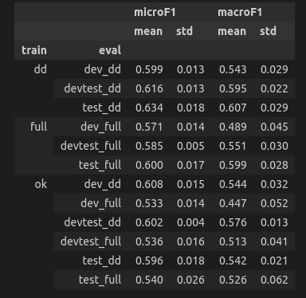

Again we can see that setups `train: ok, eval: *_dd` prove a bit better than the rest of the models, trained on `ok`.

The highest scores, however, can be found with the setups `train: dd, eval: *_dd`.

We can also see a trend that inclusion of `dev` split seems to be detrimental to the models performance: except `train: ok, eval: *_dd` all of the setups show better performance when evaluated on test than when evaluated on dev, with devtest being in the middle.


Graphically we can represent these metrics like this:

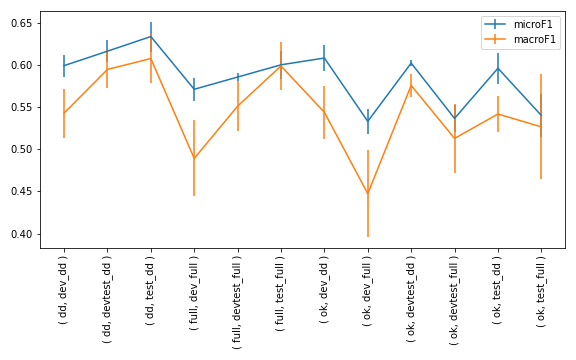


### Results analysis - group by train data setup:

Let us dissect the table below a bit. First we group it by training data setup:

|(trained on, evaluated on)|   ('microF1', 'mean') |   ('microF1', 'std') |   ('macroF1', 'mean') |   ('macroF1', 'std') |
|:-------------------------|----------------------:|---------------------:|----------------------:|---------------------:|
| ('dd', 'dev_dd')         |              0.598995 |           0.0130072  |              0.542702 |            0.0290347 |
| ('dd', 'devtest_dd')     |              0.616162 |           0.0133624  |              0.594515 |            0.0224479 |
| ('dd', 'test_dd')        |              0.633503 |           0.0177302  |              0.607424 |            0.0285351 |

We can clearly see that where we trained on `dd` dataset,  `test` performs better than `dev`, with `devtest` in between. This holds for both metrics.

|(trained on, evaluated on)|   ('microF1', 'mean') |   ('microF1', 'std') |   ('macroF1', 'mean') |   ('macroF1', 'std') |
|:-------------------------|----------------------:|---------------------:|----------------------:|---------------------:|
| ('full', 'dev_full')     |              0.571    |           0.0138744  |              0.489071 |            0.0449579 |
| ('full', 'devtest_full') |              0.5855   |           0.00512348 |              0.550986 |            0.0297173 |
| ('full', 'test_full')    |              0.6      |           0.0165831  |              0.598651 |            0.0283954 |

Again, the same is true for training on `full` train set.

|(trained on, evaluated on)|   ('microF1', 'mean') |   ('microF1', 'std') |   ('macroF1', 'mean') |   ('macroF1', 'std') |
|:-------------------------|----------------------:|---------------------:|----------------------:|---------------------:|
| ('ok', 'dev_full')       |              0.533    |           0.0144049  |              0.447262 |            0.051518  |
| ('ok', 'devtest_full')   |              0.5365   |           0.0162596  |              0.512773 |            0.0412814 |
| ('ok', 'test_full')      |              0.54     |           0.0259808  |              0.52644  |            0.0622833 |

The same behaviour can be seen if we train on data where `keep==True`, but only if we evaluate on `full` datasets. If we use deduplicated datasets for evaluation, we find a weak inverted trend in `microF1`, but we do not see the same trend in `macroF1`:


|(trained on, evaluated on)|   ('microF1', 'mean') |   ('microF1', 'std') |   ('macroF1', 'mean') |   ('macroF1', 'std') |
|:-------------------------|----------------------:|---------------------:|----------------------:|---------------------:|
| ('ok', 'dev_dd')         |              0.60804  |           0.0154885  |              0.543725 |            0.0315722 |
| ('ok', 'devtest_dd')     |              0.60202  |           0.00382974 |              0.575571 |            0.0133973 |
| ('ok', 'test_dd')        |              0.595939 |           0.018161   |              0.541691 |            0.020998  |

The last table could benefit some statistical analysis.

If we compare microF1 for presumed best setup ('ok', 'dev_dd') vs ('ok', 'devtest_dd'), we find that MannWhitney U test p-value is 0.144, meaning that we cannot be certain the first setup is better. If we continue and try the ('ok', 'devtest_dd') as presumed best and ('ok', 'test_dd') as presumed worse, we get p-value of 0.336.

For macroF1 the first p-value is 0.953, while the second p-value is 0.0184


### Results analysis - group by evaluation dataset setup:


|(trained on, evaluated on)|   ('microF1', 'mean') |   ('microF1', 'std') |   ('macroF1', 'mean') |   ('macroF1', 'std') |
|:-------------------------|----------------------:|---------------------:|----------------------:|---------------------:|
| ('dd', 'dev_dd')         |              0.598995 |           0.0130072  |              0.542702 |            0.0290347 |
| ('ok', 'dev_dd')         |              0.60804  |           0.0154885  |              0.543725 |            0.0315722 |

|(trained on, evaluated on)|   ('microF1', 'mean') |   ('microF1', 'std') |   ('macroF1', 'mean') |   ('macroF1', 'std') |
|:-------------------------|----------------------:|---------------------:|----------------------:|---------------------:|
| ('ok', 'dev_full')       |              0.533    |           0.0144049  |              0.447262 |            0.051518  |
| ('full', 'dev_full')     |              0.571    |           0.0138744  |              0.489071 |            0.0449579 |

|(trained on, evaluated on)|   ('microF1', 'mean') |   ('microF1', 'std') |   ('macroF1', 'mean') |   ('macroF1', 'std') |
|:-------------------------|----------------------:|---------------------:|----------------------:|---------------------:|
| ('ok', 'devtest_dd')     |              0.60202  |           0.00382974 |              0.575571 |            0.0133973 |
| ('dd', 'devtest_dd')     |              0.616162 |           0.0133624  |              0.594515 |            0.0224479 |

|(trained on, evaluated on)|   ('microF1', 'mean') |   ('microF1', 'std') |   ('macroF1', 'mean') |   ('macroF1', 'std') |
|:-------------------------|----------------------:|---------------------:|----------------------:|---------------------:|
| ('ok', 'devtest_full')   |              0.5365   |           0.0162596  |              0.512773 |            0.0412814 |
| ('full', 'devtest_full') |              0.5855   |           0.00512348 |              0.550986 |            0.0297173 |

|(trained on, evaluated on)|   ('microF1', 'mean') |   ('microF1', 'std') |   ('macroF1', 'mean') |   ('macroF1', 'std') |
|:-------------------------|----------------------:|---------------------:|----------------------:|---------------------:|
| ('ok', 'test_dd')        |              0.595939 |           0.018161   |              0.541691 |            0.020998  |
| ('dd', 'test_dd')        |              0.633503 |           0.0177302  |              0.607424 |            0.0285351 |

|(trained on, evaluated on)|   ('microF1', 'mean') |   ('microF1', 'std') |   ('macroF1', 'mean') |   ('macroF1', 'std') |
|:-------------------------|----------------------:|---------------------:|----------------------:|---------------------:|
| ('ok', 'test_full')      |              0.54     |           0.0259808  |              0.52644  |            0.0622833 |
| ('full', 'test_full')    |              0.6      |           0.0165831  |              0.598651 |            0.0283954 |

The experiments, performed on the same evaluation split, have been sorted in ascending F1 score. Micro and Macro F1 correlate very well, we have no pair where one would increase and the other would decrease.


### Results analysis - group by evaluation dataset split:


|(trained on, evaluated on)|   ('microF1', 'mean') |   ('microF1', 'std') |   ('macroF1', 'mean') |   ('macroF1', 'std') |
|:-------------------------|----------------------:|---------------------:|----------------------:|---------------------:|
| ('ok', 'dev_full')       |              0.533    |           0.0144049  |              0.447262 |            0.051518  |
| ('full', 'dev_full')     |              0.571    |           0.0138744  |              0.489071 |            0.0449579 |
| ('dd', 'dev_dd')         |              0.598995 |           0.0130072  |              0.542702 |            0.0290347 |
| ('ok', 'dev_dd')         |              0.60804  |           0.0154885  |              0.543725 |            0.0315722 |

|(trained on, evaluated on)|   ('microF1', 'mean') |   ('microF1', 'std') |   ('macroF1', 'mean') |   ('macroF1', 'std') |
|:-------------------------|----------------------:|---------------------:|----------------------:|---------------------:|
| ('ok', 'devtest_full')   |              0.5365   |           0.0162596  |              0.512773 |            0.0412814 |
| ('full', 'devtest_full') |              0.5855   |           0.00512348 |              0.550986 |            0.0297173 |
| ('ok', 'devtest_dd')     |              0.60202  |           0.00382974 |              0.575571 |            0.0133973 |
| ('dd', 'devtest_dd')     |              0.616162 |           0.0133624  |              0.594515 |            0.0224479 |

|(trained on, evaluated on)|   ('microF1', 'mean') |   ('microF1', 'std') |   ('macroF1', 'mean') |   ('macroF1', 'std') |
|:-------------------------|----------------------:|---------------------:|----------------------:|---------------------:|
| ('ok', 'test_full')      |              0.54     |           0.0259808  |              0.52644  |            0.0622833 |
| ('ok', 'test_dd')        |              0.595939 |           0.018161   |              0.541691 |            0.020998  |
| ('full', 'test_full')    |              0.6      |           0.0165831  |              0.598651 |            0.0283954 |
| ('dd', 'test_dd')        |              0.633503 |           0.0177302  |              0.607424 |            0.0285351 |

In general, deduplicated evaluation datasets seem to outperform full evaluation datasets.


### Generalised findings:

* Re: evaluation data: `dev < devtest < test`
* Re: evaluation data preparation: `full < dedup `
* Re: choice of training data preparation: inconclusive.

If we look at the results purely from the training data preparation and with paying no attention at the evaluation side of the experiment, we get the following:

| train   |   ('microF1', 'mean') |   ('microF1', 'std') |   ('macroF1', 'mean') |   ('macroF1', 'std') |
|:--------|----------------------:|---------------------:|----------------------:|---------------------:|
| ok      |               0.56925 |            0.0369484 |              0.524577 |            0.0545578 |
| full    |               0.5855  |            0.017066  |              0.546236 |            0.0567143 |
| dd      |               0.61622 |            0.0200452 |              0.581547 |            0.0381523 |

Averaged across all evaluation setups it seems it would be better to train on deduplicated data.

If we chose to follow the best setup, we would train on deduplicated train and evaluate on deduplicated test, which is precisely the setup that actually produces best performance in our experiments.

TO-DO:
* Start on second experiment: secondary labels. Deduplicated on train and on evaluation dataset, secondary labels only for train.
* Keep the true and predicted labels in the future.
* Explain the difference with last week's experiments. Why `ok, test_dd` proved best last week but not today? Why are last weeks metrics so high? Check the code, if there are no bugs, rerun last week's code. 
* In the future: use dev and test splits. Go with `dd` data.
* Include more statistical analyses in the future.


# Addendum 2021-11-09T15:25:08

I start preparing the Q2 experiments. Secondary labels will be added only on train side. `dd` data will be used on all splits. Afterward each training statistics were calculated and predictions were logged.


|trained on, evaluated on        |   ('microF1', 'mean') |   ('microF1', 'std') |   ('macroF1', 'mean') |   ('macroF1', 'std') |
|:-------------------------------|----------------------:|---------------------:|----------------------:|---------------------:|
| ('dd', 'dev_dd')               |              0.598995 |           0.0130072  |              0.542702 |            0.0290347 |
| ('dd', 'devtest_dd')           |              0.616162 |           0.0133624  |              0.594515 |            0.0224479 |
| ('dd', 'test_dd')              |              0.633503 |           0.0177302  |              0.607424 |            0.0285351 |
| ('secondary_dd', 'dev_dd')     |              0.628141 |           0.0132952  |              0.509099 |            0.0397219 |
| ('secondary_dd', 'devtest_dd') |              0.631313 |           0.00954456 |              0.54334  |            0.0182572 |
| ('secondary_dd', 'test_dd')    |              0.634518 |           0.0118271  |              0.557786 |            0.0273217 |

If we compare the performance side by side for every evaluation setup, we get the following triplet of tables:

|trained on, evaluated on        |   ('microF1', 'mean') |   ('microF1', 'std') |   ('macroF1', 'mean') |   ('macroF1', 'std') |
|:-------------------------------|----------------------:|---------------------:|----------------------:|---------------------:|
| ('dd', 'dev_dd')               |              0.598995 |           0.0130072  |              0.542702 |            0.0290347 |
| ('secondary_dd', 'dev_dd')     |              0.628141 |           0.0132952  |              0.509099 |            0.0397219 |

|trained on, evaluated on        |   ('microF1', 'mean') |   ('microF1', 'std') |   ('macroF1', 'mean') |   ('macroF1', 'std') |
|:-------------------------------|----------------------:|---------------------:|----------------------:|---------------------:|
| ('dd', 'devtest_dd')           |              0.616162 |           0.0133624  |              0.594515 |            0.0224479 |
| ('secondary_dd', 'devtest_dd') |              0.631313 |           0.00954456 |              0.54334  |            0.0182572 |

|trained on, evaluated on        |   ('microF1', 'mean') |   ('microF1', 'std') |   ('macroF1', 'mean') |   ('macroF1', 'std') |
|:-------------------------------|----------------------:|---------------------:|----------------------:|---------------------:|
| ('dd', 'test_dd')              |              0.633503 |           0.0177302  |              0.607424 |            0.0285351 |
| ('secondary_dd', 'test_dd')    |              0.634518 |           0.0118271  |              0.557786 |            0.0273217 |

Again we can look at the data without looking at the evaluation split:

| train        |   ('microF1', 'mean') |   ('microF1', 'std') |   ('macroF1', 'mean') |   ('macroF1', 'std') |
|:-------------|----------------------:|---------------------:|----------------------:|---------------------:|
| dd           |              0.61622  |            0.0200452 |              0.581547 |            0.0381523 |
| secondary_dd |              0.631324 |            0.0116905 |              0.536742 |            0.0356639 |

Some observations:
* Training on secondary labels seems to improve performance on dev split, not so much on test split.
* In general inclusion of secondary labels improves micro-F1, but lowers macro-F1 scores.